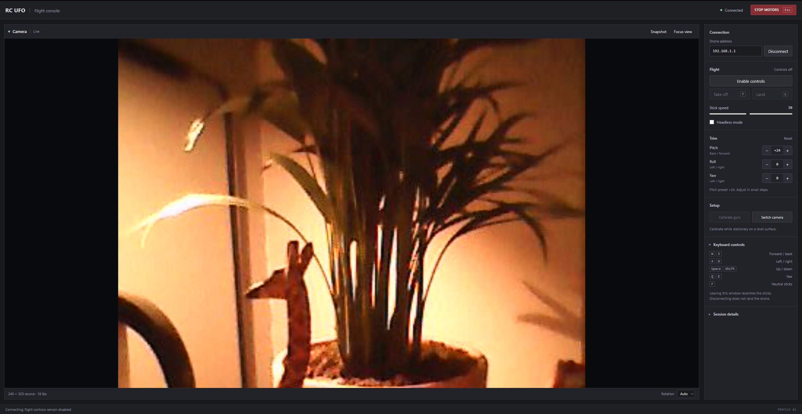

# E99 / RC UFO Drone Controller

A Python flight console for an E99 Wi-Fi drone using the RC UFO Android app protocol. View the live camera, fly with keyboard controls, and adjust trim from a local browser interface.

The protocol was reconstructed from the Android app and checked against the test aircraft. The current client supports **device profile 83**, using the TC nine-byte control format.



## Features

- Live RTSP video over UDP, with automatic rotation and a camera-focused layout.
- Keyboard flight controls, take-off, landing, and emergency motor stop.
- Independent movement and yaw strength, plus pitch, roll, and yaw trim.
- Gyro calibration, camera switching, and snapshots.
- Session logs containing commands, outgoing packets, and decoder diagnostics.
- Offline demo mode for checking the interface without connecting to a drone.

## Requirements

- Python **3.10 or newer**.
- [FFmpeg](https://ffmpeg.org/download.html) available on `PATH` for live video.
- A desktop browser.
- A direct Wi-Fi connection to a compatible drone.

The Python dependency is Pillow, installed through `requirements.txt`. Development and hardware testing have been performed on Windows.

## Quick start

Clone the repository, open PowerShell in the project directory, and create an environment:

```powershell
python -m venv .venv
.\.venv\Scripts\python.exe -m pip install -r requirements.txt
```

Check that FFmpeg is available:

```powershell
ffmpeg -version
```

Connect the PC to the drone's Wi-Fi, close other flight-control apps, then launch:

```powershell
.\.venv\Scripts\python.exe .\rcufo_controller.py
```

The controller opens a local browser page. Keep the Python terminal running.

1. Click **Connect** and wait for the live camera and profile **83**.
2. Click **Enable controls**.
3. With the drone stationary on a level surface, click **Calibrate gyro** and wait for the countdown.
4. Use **Take off**, then fly with the keyboard. Use **Land** before disconnecting.

> **Closing or disconnecting does not land the drone.** Emergency stop cuts the motors and can cause a fall.

To preview the interface without hardware:

```powershell
.\.venv\Scripts\python.exe .\rcufo_controller.py --demo
```

## Controls

| Key | Action |
| --- | --- |
| W / S | Forward / backward |
| A / D | Left / right |
| Space / Shift | Up / down |
| Q / E | Yaw left / right |
| T | Take off |
| L | Land |
| F | Neutral sticks |
| Esc | Emergency motor stop |

Movement keys work while the speed sliders have focus. Typing in the drone-address field does not send flight input. Releasing keys or leaving the window returns the sticks to their resting values, including trim.

**Focus view** hides the side panel while keeping emergency stop accessible. Camera rotation, snapshots, headless mode, and camera selection are available in the interface.

### Defaults and trim

| Setting | Default |
| --- | --- |
| Drone address | `192.168.1.1` |
| Movement strength | `30` |
| Yaw strength | `64` |
| Pitch trim | `+24` |
| Roll / yaw trim | `0` |

The pitch preset comes from the test aircraft's hover behaviour; adjust it for another unit. Each trim step changes the offset by 2. **Reset** restores the preset, and each new launch starts with these defaults.

Calibration sends untrimmed neutral sticks for two seconds, then resumes the selected trim. Take-off is blocked during that command; landing and emergency stop remain available. The countdown shows command duration, not a firmware acknowledgement.

## Command-line options

| Option | Purpose |
| --- | --- |
| `--host ADDRESS` | Set the drone's private IPv4 address. |
| `--ffmpeg PATH` | Use a specific FFmpeg executable. |
| `--connect` | Connect on launch; flight controls remain disabled. |
| `--demo` | Use simulated video and controls. |
| `--no-browser` | Print the local URL without opening a browser. |

Example with an explicit FFmpeg path:

```powershell
.\.venv\Scripts\python.exe .\rcufo_controller.py --ffmpeg 'C:\ffmpeg\bin\ffmpeg.exe'
```

## Logs and troubleshooting

Each launch creates a timestamped folder under `results/flights/`.

| File | Contents |
| --- | --- |
| `events.jsonl` | Commands, transmitted packets, connection changes, and errors. |
| `ffmpeg.log` | Video decoder diagnostics. |
| `first-frame.jpg` | First decoded frame, before display rotation. |
| `snapshot-*.jpg` | Requested snapshots. |
| `session.json` | Event counts saved on normal shutdown. |

If status replies arrive but the video remains blank, check `ffmpeg.log` and inbound UDP permissions for Python and FFmpeg. If the drone drifts, check calibration and adjust trim gradually. If yaw feels weak, adjust **Yaw strength** independently of movement speed.

The local interface binds to `127.0.0.1` and uses a random access token. Keep its URL private while the controller is running.

### Service probe

`drone_probe.py` checks the documented RTSP, HTTP, FTP, TCP, and heartbeat endpoints and writes reports to `results/probes/`.

```powershell
.\.venv\Scripts\python.exe .\drone_probe.py --transport udp
```

The probe records service responses, authentication results, and media-access evidence. It sends no flight commands or configuration changes.

## Protocol and scope

| Channel | Endpoint |
| --- | --- |
| Flight control and heartbeat | UDP `192.168.1.1:7099` |
| Live camera | `rtsp://192.168.1.1:7070/webcam` over UDP RTP |
| Browser interface | Loopback address and an automatically selected port |

Flight packets are sent at nominally **20 Hz**, independently of video decoding. Controls start disabled and are disabled again if status replies stop for three seconds or browser input stops updating for half a second. Re-enabling is manual.

These are client-side checks; the drone's firmware failsafe behaviour is not established. Other E99 firmware variants and the extended GL packet format are not supported. The client provides manual flight control rather than autonomous navigation or position hold.

## Project structure

```text
rcufo_controller.py      Local browser controller
drone_probe.py           Service inspection tool
rcufo/
  control.py             Flight packets and UDP control loop
  video.py               FFmpeg video decoding and session logs
  assets/                HTML, CSS, and JavaScript interface
docs/images/             README screenshot
requirements.txt         Python dependencies
results/                 Generated session and probe output
```
